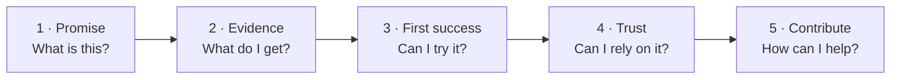

<div align="center">
  <h1>✨ BeautifulRepo</h1>
  <p><strong>Make your repository easy to understand, pleasant to explore, and worth contributing to.</strong></p>
  <p>Practical patterns, templates, examples, and tiny offline tools for maintainers who want the repository itself to feel finished.</p>
</div>

<p align="center">
  <a href="https://github.com/drevendev/BeautifulRepo/actions/workflows/quality.yml"></a>
  <a href="LICENSE"></a>
  <a href="tools/README.md"></a>
  <a href="tools/README.md"></a>
</p>

<p align="center">
  <a href="#start-here">Start here</a> ·
  <a href="checklists/repository.md">Checklist</a> ·
  <a href="guides/readme.md">README guide</a> ·
  <a href="guides/readme-visuals.md">Visual patterns</a> ·
  <a href="templates/README.template.md">Templates</a> ·
  <a href="catalog/README.md">Resources</a> ·
  <a href="CONTRIBUTING.md">Contribute</a>
</p>

---

> [!TIP]
> **Beautiful is not “more decoration.”** A strong repository reduces the time from landing on the page to understanding the result, trying it, trusting it, and knowing how to contribute.

## Start here

| If you are… | Start with… | Outcome |
| --- | --- | --- |
| improving an existing repository | [Essential repository checklist](checklists/repository.md) | Find the first broken step in the visitor journey |
| starting a repository from scratch | [Release-note guide and template](guides/release-notes.md) | Write user-impact summaries, upgrade instructions and evidence-backed change notes |
| [README scaffold](templates/README.template.md) | Get a useful structure without filler |
| polishing the first screen | [Visual README patterns](guides/readme-visuals.md) | Use screenshots, diagrams, badges and theme-aware media as evidence |
| preparing community surfaces | [Community safety readiness](guides/community-safety.md) | Publish only promises your project can actually operate |
| writing upgrade announcements | [Release-note writing guide](guides/release-notes.md) and [editable template](templates/RELEASE_NOTES.template.md) | Explain impact, upgrade steps and verified evidence without inventing a release |
| looking for proven references | [Annotated pattern studies](case-studies/first-patterns.md) | Borrow patterns without copying branding or protected expression |
| documenting a CLI | [CLI starter guide](guides/cli-repositories.md) and [working example](examples/cli-starter/README.md) | Show a command, expected output and honest install boundaries |
| automating quality checks | [Repository tools](tools/README.md) | Validate the catalog and repository-owned Markdown paths offline |

## The visitor journey

A repository should answer the next question before the reader has to hunt for it.



That sequence is the core BeautifulRepo test. Decoration is optional; a clear path is not.

## What you get

| | |
| --- | --- |
| **📋 Checklists** — prioritize clarity, onboarding, trust, accessibility and maintenance. | **🧱 Patterns** — source-backed examples of what strong repositories do and why it works. |
| **🧰 Templates** — reusable README and security-policy scaffolds with explicit placeholders. | **🔎 Tools** — small dependency-free checks that keep repository documentation honest. |
| **🖼️ Visual guidance** — theme-aware media, useful alt text and evidence-first screenshots. | **🧭 Community guidance** — contribution and reporting surfaces that do not invent unsupported promises. |

## See the difference

The fictional [PocketDiff before/after example](examples/readme-visuals/README.md) shows the principle in one screen:

**Before:** vague superlatives, badge clutter, and a missing demo doing all the explanatory work.

**After:** one concrete outcome, a representative result, nearby text equivalence, a real command, and a clear first-success path.

That is the standard this repository applies to itself: **promise → evidence → action**, with important information remaining readable without images.

## This repository checks itself

BeautifulRepo includes small offline checks instead of relying on “looks good to me.”

From a checkout with **Python 3.11+**:

```bash
python tools/catalog.py
python tools/docs_links.py
python -m unittest discover -s tests -v
```

The same checks run in GitHub Actions. They validate structured catalog metadata, generated catalog drift, repository-owned relative Markdown destinations, and structural regressions in the examples and public repository surfaces.

They do **not** claim to be a live-link crawler, security scanner, runtime accessibility certification, or repository beauty score. Manual judgement still matters.

## Explore the handbook

| Material | Use it for |
| --- | --- |
| [Repository checklist](checklists/repository.md) | Prioritize essential information, polish and maintenance |
| [README design guide](guides/readme.md) | Build a useful front page without turning it into a manual |
| [Visual README patterns](guides/readme-visuals.md) | Make screenshots, diagrams and theme-aware media carry evidence |
| [CLI repository starter](guides/cli-repositories.md) | Document commands, predictable outputs, error cases and installation claims with a tested example |
| [README scaffold](templates/README.template.md) | Adapt a starting structure to your own project |
| [Annotated pattern studies](case-studies/first-patterns.md) | Learn from Devostasis, Hungry Crab, Gum and other inspected repositories |
| [Curated source catalog](catalog/README.md) | Find primary guidance with application notes and caveats |
| [Programs and community events](guides/programs.md) | Separate current program rules from evergreen preparation |
| [Community safety readiness](guides/community-safety.md) | Keep reporting and enforcement promises operationally honest |
| [Roadmap](ROADMAP.md) | See what exists and what comes next |

## Principles

**Clarity before decoration.** Explain the result before the implementation.  
**Evidence before badges.** A badge must represent a real, relevant fact.  
**Patterns before imitation.** Reuse ideas; verify permissions before copying material.  
**Useful before exhaustive.** Every resource needs a reason to exist and a next action.  
**Accessible by default.** Keep essential information readable without images, animation or color.

## Status and contribution

BeautifulRepo is a working handbook, not an exhaustive or independently certified standard.
The [roadmap](ROADMAP.md) tracks deeper examples, more reusable templates, tool experiments and accessibility work.

Suggestions and small improvements are welcome. Start with [CONTRIBUTING.md](CONTRIBUTING.md). Please report accessibility barriers through [GitHub Issues](https://github.com/drevendev/BeautifulRepo/issues/new/choose), and follow the [community safety guidance](guides/community-safety.md) before posting sensitive material.

Public documentation is maintained in English.

## License

[MIT](LICENSE). Linked projects and their assets retain their own licenses and trademarks.
Listing a source does not endorse every claim it makes or relicense its contents.
