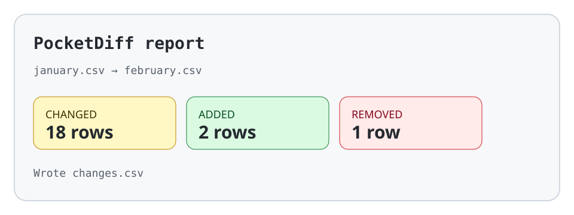

# PocketDiff — before/after README visual

`PocketDiff` is a fictional command-line tool used only to demonstrate README structure.
The commands and numbers below are illustrative and make no claim about a real package.

## Before: decoration without evidence

> **PocketDiff** — the next-generation difference engine.
>
> Fast · beautiful · modern · powerful · awesome
>
> [build badge] [coverage badge] [downloads badge] [chat badge] [stars badge]
>
> *See the demo to understand what it does.*

Problems: the outcome is vague, badges occupy the evidence slot, and the missing demo is
doing essential explanatory work.

## After: result first

**Compare two CSV exports locally and get a row-level change report without uploading either file.**

<picture>
  <source media="(prefers-color-scheme: dark)" srcset="./hero-dark.svg">
  <source media="(prefers-color-scheme: light)" srcset="./hero-light.svg">
  
</picture>

The preview shows the same facts in text: **18 changed rows**, **2 added**, **1 removed**,
and a report written to `changes.csv`. Color is decorative; the labels and numbers carry the
meaning.

```console
$ pocketdiff january.csv february.csv --output changes.csv
18 changed · 2 added · 1 removed
Wrote changes.csv
```

**First success:** run the command against two CSV files with the same key column. The tool
writes a local report; it does not need an upload step in this fictional example.

[Read the visual README guide](../../guides/readme-visuals.md).

## Why the after version is stronger

The project outcome is readable before the image loads. The visual shows a representative
result instead of a slogan. The alt text and nearby prose preserve the same information for
non-visual reading. The local assets have explicit light/dark variants and no third-party
branding. The terminal block gives a concrete next move and expected result.
